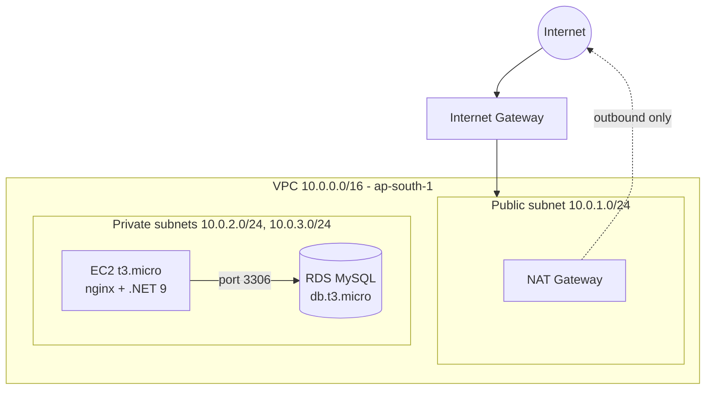

# Rent A Car - AWS Infrastructure with Terraform

Infrastructure as code for deploying a .NET 9 minimal API to AWS, provisioning a segmented VPC, a private EC2 application server, and a managed MySQL database, entirely through Terraform.

## Architecture



The application server and database sit in private subnets with no public IP addresses. Outbound internet access for package installation flows through a NAT Gateway; inbound access for operators flows through AWS Systems Manager Session Manager rather than SSH, so no inbound ports are exposed on the instance.

## Stack

| Layer | Technology |
|---|---|
| IaC | Terraform, AWS provider |
| Compute | EC2 (Amazon Linux 2023), t3.micro |
| Database | RDS MySQL 8.0, db.t3.micro |
| Application | ASP.NET Core 9 minimal API, EF Core, Pomelo MySQL provider |
| Reverse proxy | nginx |
| Secrets | AWS Systems Manager Parameter Store (SecureString) |
| Access | AWS Systems Manager Session Manager (no SSH, no bastion) |

## Design decisions

**Network segmentation.** The application and database run in private subnets with no route to the internet. A NAT Gateway in the public subnet provides one-way outbound access for OS updates and package installs. The RDS subnet group spans two availability zones, satisfying AWS's requirement for a subnet group even though the current deployment runs single-AZ.

**No inbound SSH.** The EC2 instance carries an IAM role scoped to `AmazonSSMManagedInstanceCore`, and all administrative access goes through Session Manager. There is no key pair, no open port 22, and no bastion host to maintain.

**Secrets handling.** The RDS master password is generated at apply time and stored as an encrypted SecureString in Parameter Store, never committed to source control or written to a plaintext config file. The EC2 IAM role is granted read access to that single parameter only, following least privilege. A systemd `ExecStartPre` hook resolves the password at service start rather than baking it into the unit file.

**Application startup.** The API calls `EnsureCreated()` on startup to provision its schema against MySQL, appropriate for a small practice deployment; a production system would use versioned EF Core migrations instead.

## Repository layout

```
terraform/
  providers.tf        AWS provider and region configuration
  variables.tf         Configurable inputs (instance sizes, CIDR ranges, credentials)
  vpc.tf                VPC, subnets, routing, NAT and internet gateways
  security_groups.tf   Least-privilege firewall rules for EC2 and RDS
  ec2.tf                Application server, IAM role, instance profile
  secrets.tf            Parameter Store secret and IAM read policy
  rds.tf                MySQL instance and subnet group
  outputs.tf            Resource identifiers and endpoints
  user_data.sh          First-boot provisioning script
```

## Deployment

Prerequisites: Terraform >= 1.5, AWS CLI configured with credentials, Session Manager plugin installed.

```bash
cd terraform
terraform init
terraform plan  -var="db_password=<your-password>"
terraform apply -var="db_password=<your-password>"
```

Application deployment onto the provisioned instance:

```bash
aws ssm start-session --target <instance-id>

sudo mkdir -p /opt && cd /opt
sudo git clone https://github.com/umar2809/Rent_A_Car.git
cd Rent_A_Car && sudo git checkout main

sudo -i
export TMPDIR=/home/ssm-user/dotnet-install-tmp
mkdir -p $TMPDIR
curl -sSL https://dot.net/v1/dotnet-install.sh -o $TMPDIR/dotnet-install.sh
chmod +x $TMPDIR/dotnet-install.sh
$TMPDIR/dotnet-install.sh --channel 9.0 --install-dir /usr/share/dotnet
dnf install -y libicu

cd /opt/Rent_A_Car
dotnet publish -c Release -o /opt/rentacar-app
```

The systemd unit and nginx reverse proxy configuration are provisioned automatically by `user_data.sh` on first boot.

Full teardown:
```bash
terraform destroy -var="db_password=<your-password>"
```

## Cost notes

EC2 and RDS run on t3.micro / db.t3.micro, eligible for AWS Free Tier during an account's first 12 months. The NAT Gateway is billed hourly plus data processed regardless of account age and is the primary cost driver in this stack; destroy the environment when not actively in use.

## Troubleshooting log

Issues encountered and resolved during initial deployment, kept here as a reference for anyone reproducing this setup:

- **SSM agent not registering** - default AMI does not enable `amazon-ssm-agent` at boot; explicitly enabled in `user_data.sh`.
- **Root volume too small** - default AMI ships a 2GB root disk; `root_block_device` in `ec2.tf` sets this to 20GB.
- **SDK extraction failing with disk space errors despite free space** - the install script defaults to `/tmp`, a small RAM-backed filesystem; redirected via `TMPDIR` to a path on the real disk.
- **Missing ICU library** - the .NET SDK requires `libicu` for globalization support on Amazon Linux 2023.
- **nginx serving its default page instead of the app** - `nginx.conf` ships a built-in default `server` block that takes precedence over `conf.d` includes; removed to let the reverse proxy config take effect.
- **`Table does not exist` on first request** - migrating from EF Core InMemory to MySQL does not auto-create schema; added `Database.EnsureCreated()` at startup.
- **systemd unit failing with "unavailable resources"** - `EnvironmentFile` pointed at a file not yet created by `ExecStartPre` on first run; marked optional with a leading `-`.

## Possible extensions

- Application Load Balancer in the public subnet with the EC2 instance in a target group, removing the need for Session Manager to reach the app itself.
- EF Core migrations in place of `EnsureCreated()`.
- Auto Scaling Group across both private subnets.
- CI/CD pipeline (GitHub Actions) for automated build, test, and deploy on merge to main.